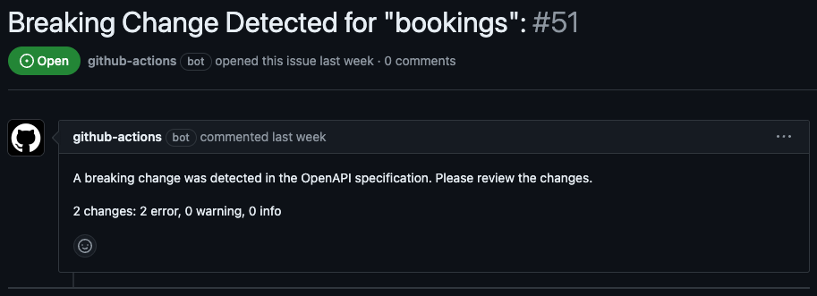
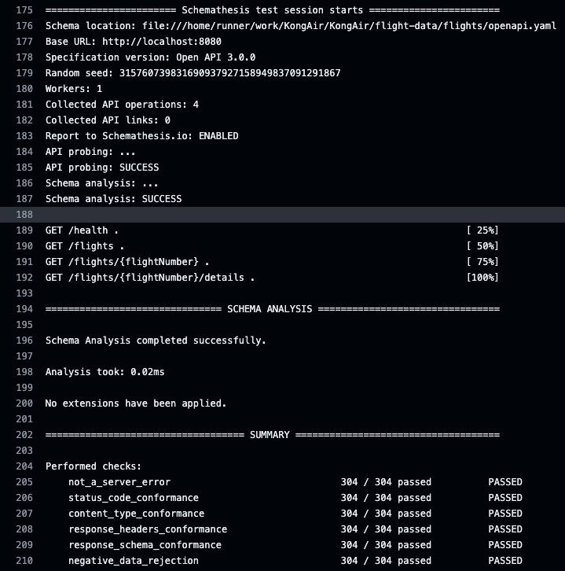
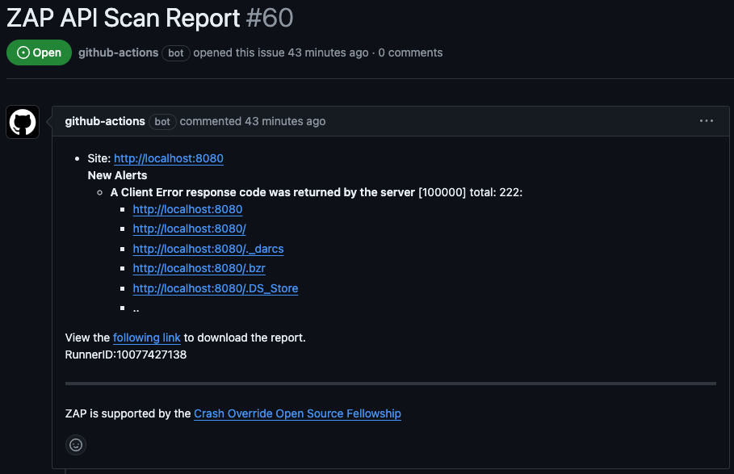
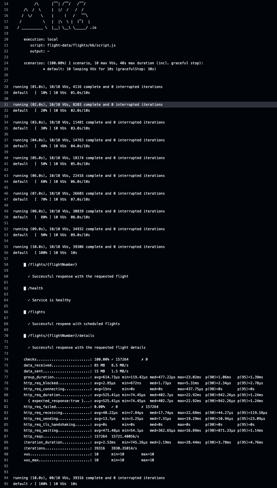
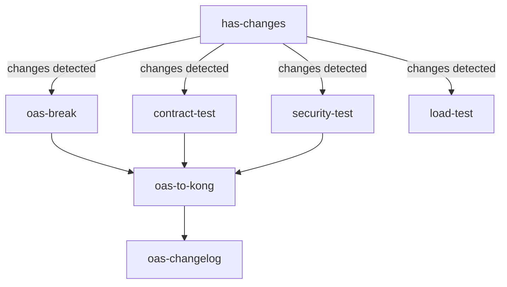

# KongAir

This repository implements an example [APIOps](https://github.com/Kong/go-apiops) pipeline for the Kong Gateway. It is based on the fictitious airline KongAir, and is modeled as a shared monorepo in which 5 teams have their code and configurations stored in folders at the top level:

* The [flight-data](flight-data/) team owns two public facing APIs that serve KongAir's flight data information services
including the [routes](flight-data/routes/) and [flights](flight-data/flights/) services.
* The [sales](sales/) engineering team owns two services that service customer needs. The [customer](/sales/customer/)
service hosts customer information including payment methods, frequent flyer information, etc...
The [bookings](/sales/bookings/) service manages customer flight bookings and depends on the public flight-data team
services.
* The [experience](experience/) team owns one service. This team uses GraphQL and builds "experience" APIs to drive applications. The experience APIs aggregate the other KongAir REST APIs to make a dynamic unified API for applications.
* The [platform](platform/) team is responsible for populating certain kong entities and apply governance
rules, but doesn't own any service. It mimics the typical responsibility of a central team that manages shared infastructure, like API Gateways.


## Workflows

Automated APIOps processes are exemplified in [GitHub Actions workflows](.github/workflows) using the Kong APIOps capabilities. There are 4 workflows defined:

### Stage changes for Kong
[This workflow](.github/workflows/stage-changes-for-kong.yaml) stages changes for the Kong Gateway configuration. It shows how to detect breaking changes in OAS specifications, and how to run API contract testing, security testing and load testing based on an OAS specification.

#### Jobs Overview

1. **Job: `has-changes`**
   - Checks if there are any changes in relevant files like specifications, configurations, or pipeline files. The following jobs will only execute if there are relevant changes.

2. **Job: `oas-break`**
   - Checks for breaking changes in the OpenAPI Specifications (OAS) and creates an issue if any are found. This is an example issue created by the workflow:

   

3. **Job: `contract-test`**
   - Runs contract testing using SchemaThesis based on the OpenAPI specifications of the services. Looking at the action output, you can see the result of the test:

   

4. **Job: `security-test`**
   - Runs security testing using OWASP ZAP Scan on the services' OpenAPI specifications. The result of the test will be informed via an Issue:

   


5. **Job: `load-test`**
   - Executes load testing using K6, generating scripts from the OpenAPI specifications. Looking at the action output, you can see the result of the test:

   

6. **Job: `oas-to-kong`**
   - Converts OpenAPI Specifications to Kong configurations, combines them, and creates a pull request for the changes.

7. **Job: `oas-changelog`**
   - Generates and posts a changelog of differences between the previous and current OAS for all services as a PR comment.


The following diagram illustrates the jobs dependencies:



### Stage Kong configuration for production
[This workflow](.github/workflows/stage-kong-for-PRD.yaml) stages changes for the Kong Gateway production configuration.

#### Jobs Overview

1. **Job: `stage-kong-for-prd`**
   - Stages the updated Kong configuration for production by copying the generated file, calculates configuration differences, and creates a pull request to deploy the changes to production.

### Deploy Kong to production

[This workflow](.github/workflows/deploy-kong-PRD.yaml) deploys changes to the Kong Gateway.

#### Jobs Overview

1. **Job: `deploy-kong`**
   - Checks out the repository, sets up the Deck tool, and synchronizes the Kong configuration with the appropriate deployment target (Konnect, Kong EE, or Kong Ingress Controller) based on the environment variable DEPLOY_TARGET.

### Generate docker images

[This workflow](.github/workflows/docker.yaml) builds and pushes Docker images for each one of the KongAir services.
#### Jobs Overview

1. **Job: `docker`**
   - Checks out the repository, sets up QEMU and Docker Buildx, logs into Docker Hub, and builds and pushes Docker images for each specified service using a matrix strategy.

## How to use this repository

### Fork the repository

To run the workflows, first fork this repository into your own GitHub account.

### Enable issue creation

Once the repository is forked in your own account, make sure to enable issue creation. Go to *Settings* and under *Features*, make sure to enable *Issues*.

### Change the repository name in docker.yaml

Update the following section of [docker.yaml](.github/workflows/docker.yaml) to point to your GitHub packages endpoint by changing the user name in the last line:

```
      - name: Build and push
        uses: docker/build-push-action@v4
        with:
          context: "${{ matrix.app.dir }}/${{ matrix.app.name }}"
          push: true
          platforms: linux/amd64,linux/arm64
          tags: ghcr.io/<your_user_name>/kongair-${{ matrix.app.name }}:latest
```

### Create a Schemathesis account

Optionally, enable [Schemathesis GitHub app](https://github.com/apps/schemathesis) to receive test results as comments in your GitHub pull requests. To use this feature, both the token and the GitHub app are required. Obtain your token by signing up on [Schemathesis.io](https://app.schemathesis.io/auth/sign-up/).
If you have a token, create a secret and uncomment the relevant lines in [the stage changes for kong workflow](.github/workflows/stage-changes-for-kong.yaml) under the *contract-test* job.

### Create secrets and variables

Go to *Settings* -> *Secrets and Variables* and create the following:
- Secrets
    - KONNECT_PAT: Your Konnect Personal Access Token
    - SCHEMATHESIS_TOKEN: Your Schemathesis token in case you have a Schemathesis account.
- Environment Variables:
    - DEPLOY_TARGET: Specify the target platform in which to deploy the kong configuration. Possible values are KONNECT for Kong Konnect, EE for Kong Enterprise Edition or KIC or Kong Ingress Controller.